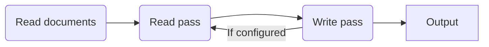

<!--
  DO NOT EDIT THIS FILE DIRECTLY!
  It is generated by djockey.
-->
- [Mermaid diagrams](../features/mermaid_diagrams.md#Mermaid-diagrams)

<div id="Mermaid-diagrams" class="section" id="Mermaid-diagrams">

# Mermaid diagrams

You can include [Mermaid](https://mermaid.js.org) diagrams using a
```` ```mermaid ```` code fence.

Example input:

````

````

Example output:


</div>


| Previous | Next |
| - | - |
| [Indexterms](../features/indexterms.md) | [Syntax highlighting](../features/syntax_highlighting.md) |